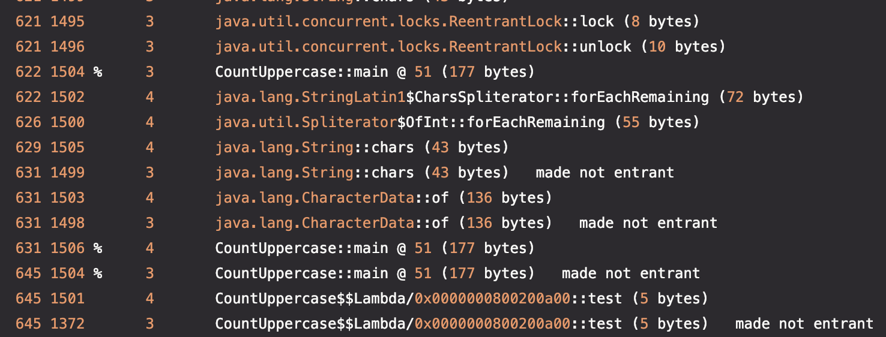

# Basic compilation in Java

1. Counts the number of uppercase characters in a body of text. To simulate a large load, the same sentence is processed 10 million times and observation of JIT activity (C1, C2)

```bash
time java -XX:+PrintCompilation CountUppercase.java Hello World > jit-compiler.log

#1 (142 ms)
#2 (99 ms)
#3 (59 ms)
#4 (61 ms)
#5 (60 ms)
#6 (56 ms)
#7 (56 ms)
#8 (65 ms)
#9 (61 ms)
#total: 19999998 (717 ms)
#1,44s user 0,12s system 131% cpu 1,188 total 352848 kb rss
```


We can observe the activity of C1 (*3*), via ***Tiried Compilation***. All the profiling data collected, together with the JIT compilation thresholds, triggers C2 (*4*).
The runtime proceeds to the de-optimization phases when the compilation hypotheses are wrong (*made not entering*).

For more information on compilation logs, see [here][explain-compilation-log]

2. Execution in pure interpretation mode (**JIT-less***)

```bash
time java -Xint CountUppercase.java Hello World

# 😴😪🥱💤🛌🏼
#1 (3305 ms)
#2 (3317 ms)
#3 (3219 ms)
#4 (3245 ms)
#5 (3272 ms)
#6 (3303 ms)
#7 (3281 ms)
#8 (3260 ms)
#9 (3270 ms)
#total: 19999998 (32722 ms)
#33,34s user 0,21s system 99% cpu 33,769 total 211296 kb rss
```
Very, very serious performance degradation, as we no longer benefit from JIT. The runtime's interpreter mode is very costly.

<!-- Links -->
[explain-compilation-log]: https://www.baeldung.com/jvm-tiered-compilation#1-compilation-logs