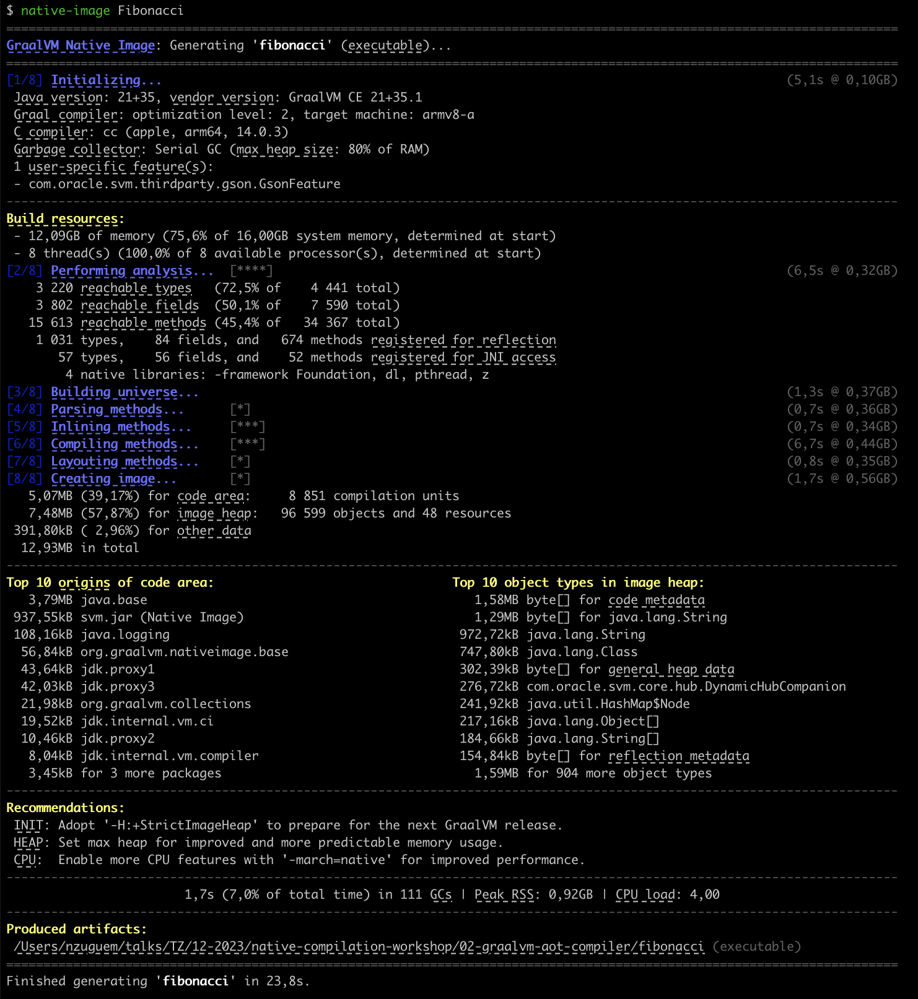

# GraalVM AOT Compiler

1. AOT compilation is another GraalVM feature. It allows you to build a native executable (optimized for a specific platform) and an automatic executable (no JVM required). It is done at build time, which guarantees low memory consumption and rapid start-up.
   The downside is that it takes a long time 

```bash
javac CountUppercase.java

native-image CountUppercase

time ./countuppercase Hello World

#1 (125 ms)
#2 (107 ms)
#3 (107 ms)
#4 (104 ms)
#5 (105 ms)
#6 (105 ms)
#7 (105 ms)
#8 (108 ms)
#9 (104 ms)
#total: 19999998 (1075 ms)
#1,05s user 0,02s system 97% cpu 1,099 total 67728 kb rss
```

With 10 million loop turns, the execution time with C2/Graal is less than with the native image. The reason is that C2/Graal performs frequent optimizations, whereas with the native image, optimization has been performed up to a certain level.

Below are the native compilation logs. For more information on this output, see this [doc][native-image-compilation-output]


## Performance measurement
- **Startup Time** *approximately equal* ***0,024 ms***
- **Memory** *approximately equal* ***67 MB***

Native-image performance (AOT) is far superior to that of [JIT](../01-graalvm-jit-compiler/README.md#performance-measurement)


<!-- links -->
[native-image-compilation-output]: https://www.graalvm.org/latest/reference-manual/native-image/overview/BuildOutput/