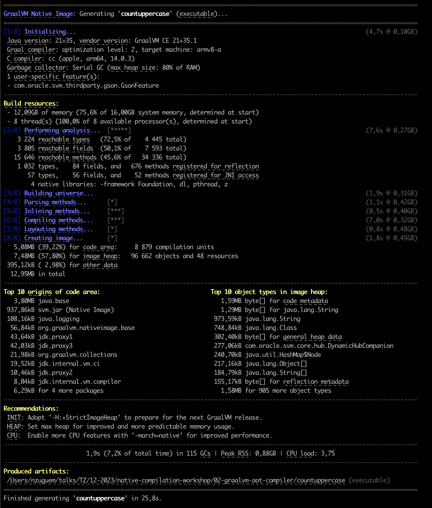

# GraalVM AOT Compiler

1. AOT compilation is another GraalVM feature. It allows you to build a native executable (optimized for a specific platform) and an automatic executable (no JVM required). It is done at build time, which guarantees low memory consumption and rapid start-up.
   The downside is that it takes a long time 

```bash
javac Fibonacci.java

native-image Fibonacci

time ./fibonacci 17 1000000
# 6,15s user 0,02s system 95% cpu 6,498 total

time ./fibonacci 17 100
# 0,00s user 0,01s system 33% cpu 0,025 total  
```

With 1 million loop turns, the execution time with C2 is less than with the native image. The reason is that C2 performs frequent optimizations, whereas with the native image, optimization has been performed up to a certain level.

Below are the native compilation logs. For more information on this output, see this [doc][native-image-compilation-output]


2. 

<!-- links -->
[native-image-compilation-output]: https://www.graalvm.org/latest/reference-manual/native-image/overview/BuildOutput/