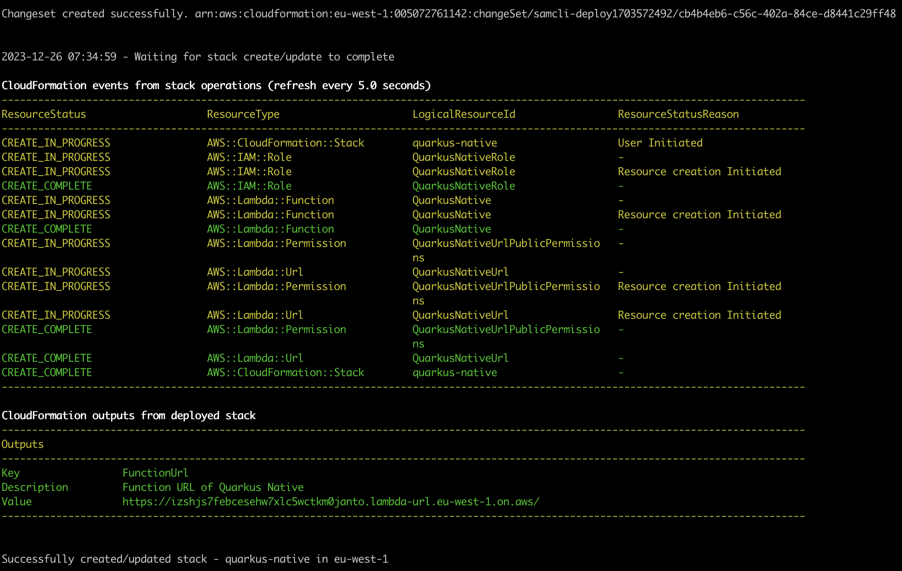
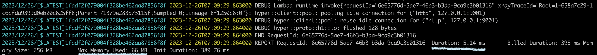

# Quarkus Native
## What is quarkus ?
Quarkus is an open source project, initiated in 2018 by Red Hat. \
It's a Cloud Native Java stack tailored for OpenJDK HotSpot and GraalVM, crafted from the best of breed Java libraries and standards.

Their mantra is ***Supersonic Subatomic Java*** :
- ***Supersonic*** -> *Startup Speed* : Quarkus does all its best to boot your application as fast as possible and to respond to the first request.
- ***Subatomic*** -> *Memory Consumption & Packaging Size* : The size of the memory used to run an application, but also the size of the executable once the application is packaged. Quarkus is optimized to reduce the amount of memory used by a Java application.

Quarkus was specifically designed with GraalVM in mind. It stands out as a framework that facilitates the adaptation of other frameworks to the challenges inherent in GraalVM, such as Dynamic Proxies, Reflection, etc... The key element of this approach is to displace, during the "build time" phase, the operations usually performed at runtime by conventional frameworks.

In this way, Quarkus' role in relation to GraalVM is to elaborate the metadata (resources, reflections, proxies, etc.) associated with the frameworks and transmit them to GraalVM for the creation of a native executable. By making this transition right from the construction phase, Quarkus bypasses the obstacles associated with GraalVM and offers a more efficient solution for generating native applications.

> The magic of quarkus lies in its extensions, which are all GraalVM-compatible by design.


> The consequences of moving these steps to build time are **less memory consumption** (*many classes have been eliminated because they are not useful in the runtime, so there are fewer classes to scan and load at startup*) and **reduced startup time** (*fewer things to do at startup*).

## Let's see it together !

1. Create Native image - The native image generated is highly dependent on the OS on which the command is run (GraalVM is installed on this OS)

```bash
./mvnw -Pnative package
```

2. Run the application in native image mode and compare with JVM mode

- Run the application in native image mode and displays the time elapsed between startup and success of the first request -> ***0.056 s***
```bash
time make start-native

#__  ____  __  _____   ___  __ ____  ______
# --/ __ \/ / / / _ | / _ \/ //_/ / / / __/
# -/ /_/ / /_/ / __ |/ , _/ ,< / /_/ /\ \
#--\___\_\____/_/ |_/_/|_/_/|_|\____/___/
# ...

#make start-native  0,01s user 0,02s system 68% cpu 0,056 total 
```

- Run the application in JVM mode and displays the time elapsed between startup and success of the first request -> ***0.565 s***
```bash
time make start-jvm

#__  ____  __  _____   ___  __ ____  ______
# --/ __ \/ / / / _ | / _ \/ //_/ / / / __/
# -/ /_/ / /_/ / __ |/ , _/ ,< / /_/ /\ \
#--\___\_\____/_/ |_/_/|_/_/|_|\____/___/
#...

#make start-jvm  0,12s user 0,22s system 60% cpu 0,565 total
```

3. Performance comparison between JVM (JIT) mode and Native Image (AOT) mode


The JVM makes heavy use of the processor during the warm-up JIT activities described above, while the native executable barely uses the processor at all, since all the costly compilation operations have taken place at the time of generation.

4. Simulation of a peak load with 1 million requests on the application in JVM mode and Native mode.

- JVM Mode -> ***Requests/sec:	63238.6862***
```bash
make load-jvm

#Summary:
#  Total:	15.8131 secs
#  Slowest:	0.2267 secs
#  Fastest:	0.0000 secs
#  Average:	0.0008 secs
#  Requests/sec:	63238.6862
# Status code distribution:
#  [200]	1000000 responses
```

- Native Image (AOT) Mode -> ***Requests/sec:	62941.2531***
```bash
make load-native

#Summary:
#  Total:	15.8878 secs
#  Slowest:	0.1570 secs
#  Fastest:	0.0000 secs
#  Average:	0.0008 secs
#  Requests/sec:	62941.2531
# Status code distribution:
#  [200]	1000000 responses
```

In JVM mode, throughput is higher. At a certain peak load level, JVM mode will have a higher throughput, due to continuous optimization via Tiered Compilation.

> Throughput is too high compared with Spring Boot, because Quarkus is a reactive framework based on Vert.x/Netty. So all requests are handled by a Vert.X Non Blocking I/O, and the switch is made to a Worker Thread depending on the programming paradigm (Imperative or Reactive): This is ***Smart Routing***
> 
>  

## Container Image and Native Image
1. Generate a Docker image based on a native image

```bash
make build-container-image-native
```

2. Generate a Docker image based on a native image (Using different native executable linking modes)

> For more details, click [here][graalvm-build-static-executables]

-  Fully Dynamic
```bash
make build-docker-image-dynamic
```

- Mostly Static
```bash
make build-docker-image-mostly
```

- Fully Static
```bash
make build-docker-image-static
```

## Deploy on AWS Lambda

> We use the AWS SAM tool (Template and CLI)

1. Build SAM Application - Custom makefile task (build native image and generate AWS Lambda artifact)

```bash
make sam-build
```

2. Deploy artefact on AWS Lambda

> ⚠️ The following 2 environment variables must be configured:
> - `AWS_ACCESS_KEY_ID=****`
> - `AWS_SECRET_ACCESS_KEY=****`
> - `AWS_DEFAULT_REGION=eu-west-1`
> 
> For more details, see [AWS SAM Prerequisites][aws-sam-prerequisites]

```bash
make sam-deploy
```


3. Let's look at logs and startup times + memory consumption

- Follow logs
```bash
make sam-logs
```
- Http call in other Terminal - the URL is the one generated following deployment `make sam-deploy`)

```bash
curl https://izshjs7febcesehw7xlc5wctkm0janto.lambda-url.eu-west-1.on.aws/hello/World
```
- Logs


The screenshot above shows **the first HTTP request to my lambda function**. Note that the application takes ***5 ms*** to start and serve the request, and consumes ***66 MB*** of memory.\
The **Init Duration** is the time Lambda takes to provision an execution environment (a component of ***cold start***). This time is billed (**Billing Duration**) because I've chosen to use *Lambda Web Adapter (LWA)*.


The screenshot above shows **the second HTTP request to my lambda function**. Note that there is no longer any **Init Duration**, as the provisioned execution environment is still available. We're on ***2 ms*** in terms of Duration, and on ***67 MB*** in terms of memory.

4. Clear

```bash
make sam-delete
```

<!-- links -->
[aws-sam-prerequisites]: https://docs.aws.amazon.com/serverless-application-model/latest/developerguide/prerequisites.html
[graalvm-build-static-executables]:https://www.graalvm.org/latest/reference-manual/native-image/guides/build-static-executables/
