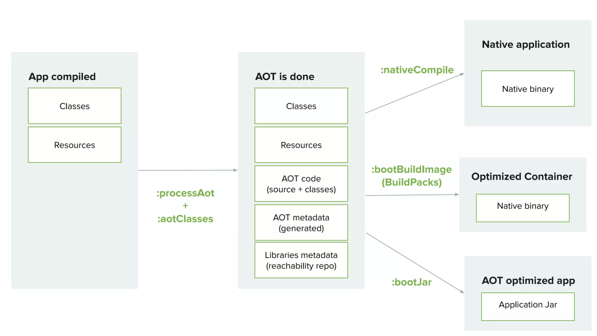
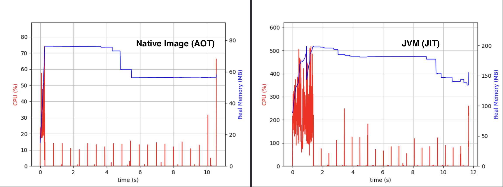

# Spring Boot Native
## AOT Processing in Spring

> It all starts with the addition of the GraalVM Native Build Tools plugin (Gradle, Maven)



In addition to **GraalVM Native Build Tools** (Gradle or Maven), the Spring Boot plugin adds some AOT-related phases to the build process. \
One of these phases is the ***processAot***. The application will be started on the basis of compiled code, with the aim of inferring on the *ApplicationContext* and generating Java code (*AOT Code*) for the registration of `BeanDefinition`, as well as configuration files for the dynamic aspect of Java (*AOT Metadata*). \
During this step, we retrieve the GraalVM reachability metadata ([reachability metadata repo][graalvm-reachability-matadata-repo]) linked to third-party libraries.

> All these artifacts will then be passed to the GraalVM "native-image" component.

1. Create Native image

```bash
# Gradle
./gradlew nativeCompile

#Maven
./mvnw -Pnative native:compile
```

2. Run the application in native image mode and compare with JVM mode

- Run the application in native image mode and displays the time elapsed between startup and success of the first request -> ***0.103 s***
```bash
time make start-native
# .   ____          _            __ _ _
# /\\ / ___'_ __ _ _(_)_ __  __ _ \ \ \ \
#( ( )\___ | '_ | '_| | '_ \/ _` | \ \ \ \
# \\/  ___)| |_)| | | | | || (_| |  ) ) ) )
#  '  |____| .__|_| |_|_| |_\__, | / / / /
# =========|_|==============|___/=/_/_/_/
# :: Spring Boot ::                (v3.2.0)
# ...
# make start-native  0,02s user 0,04s system 52% cpu 0,103 total
```
 
- Run the application in JVM mode and displays the time elapsed between startup and success of the first request -> ***1.441 s***
```bash
time make start-jvm
# .   ____          _            __ _ _
# /\\ / ___'_ __ _ _(_)_ __  __ _ \ \ \ \
#( ( )\___ | '_ | '_| | '_ \/ _` | \ \ \ \
# \\/  ___)| |_)| | | | | || (_| |  ) ) ) )
#  '  |____| .__|_| |_|_| |_\__, | / / / /
# =========|_|==============|___/=/_/_/_/
# :: Spring Boot ::                (v3.2.0)
# ...
# make start-jvm  0,29s user 0,55s system 57% cpu 1,441 total 
```

3. Performance comparison between JVM (JIT) mode and Native Image (AOT) mode


The JVM makes heavy use of the processor during the warm-up JIT activities described above, while the native executable barely uses the processor at all, since all the costly compilation operations have taken place at the time of generation.

4. Simulation of a peak load with 1 million requests on the application in JVM mode and Native mode.

- JVM Mode -> ***Requests/sec:	10178.6238***
```bash
make load-jvm

# Summary:
#  Total:	98.2451 secs
#  Slowest:	1.0354 secs
#  Fastest:	0.0000 secs
#  Average:	0.0049 secs
#  Requests/sec:	10178.6238
# Status code distribution:
#  [200]	1000000 responses
```

- Native Image (AOT) Mode -> ***Requests/sec:	12673.1533*** 
```bash
make load-native

# Summary:
#  Total:	78.9070 secs
#  Slowest:	1.0302 secs
#  Fastest:	0.0000 secs
#  Average:	0.0039 secs
#  Requests/sec:	12673.1533
# Status code distribution:
#  [200]	1000000 responses
```

In Native Image mode, throughput is higher. But never mind, at a certain peak load level, JVM mode will have a higher throughput, due to continuous optimization via Tiered Compilation.

5. To run a Spring Boot application on the JVM and have it use AOT generated code

```bash
java -Dspring.aot.enabled=true -jar build/libs/spring-native-1.0.jar
```
> If your application starts with the spring.aot.enabled property set to true, then you have higher confidence that it will work when converted to a native image. \
> It can potentially be used for integration tests, instead of `./gradlew nativeTest` or `./mvnw -PnativeTest test`, as native image tests are quite time-consuming.
## Container Image and Native Image 
1. Generate a Docker image based on a native image (using BuildPacks)

```bash
#Gradle
./gradlew bootBuildImage

#Maven
./mvnw -Pnative spring-boot:build-image 
```
<!-- links -->
[graalvm-reachability-matadata-repo]:https://github.com/oracle/graalvm-reachability-metadata